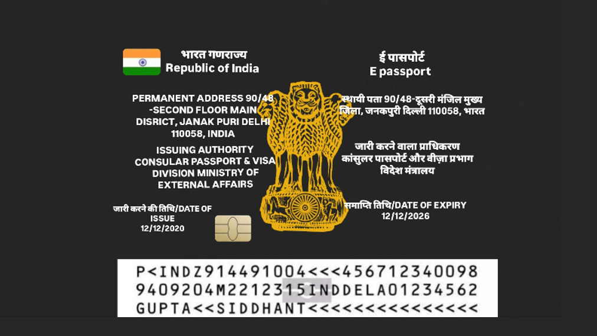

# 🛂 E-Passport Verification System

  
  

<em>Official RFID-based E-Passport cards used for verification and testing.</em>

---

## Description:

The **RFID-Based E-Passport Verification System** is a secure, automated solution designed to enhance border control operations through **Radio Frequency Identification (RFID)** technology.  
It enables **contactless, fast, and accurate** verification of travelers’ identities while maintaining data integrity and compliance with **International Civil Aviation Organization (ICAO)** standards.

This system integrates **RFID readers**, **Arduino microcontrollers**, and **secure verification software** to authenticate e-passports, cross-check biometric data, and prevent fraud or unauthorized access.  

---

## How It Works:

- The RFID reader scans the **embedded chip** in an e-passport.  
- Data such as **passport number**, **personal details**, **photo**, and **biometrics** are securely transmitted to a verification server.  
- The server performs multiple layers of authentication:  
  - **Passive Authentication:** Checks digital signature integrity.  
  - **Active Authentication:** Verifies chip authenticity to prevent cloning.  
  - **Biometric Matching:** Confirms traveler identity using live scan data.  
- Traveler details are cross-verified with **watchlists** and **national databases**.  
- Results are displayed instantly on the verification interface for immigration officials.

---

## Features:

- **Enhanced Security:** Encrypted data transmission prevents cloning and tampering.  
- **Biometric Verification:** Integrates fingerprint or facial data for reliable identity matching.  
- **Real-Time Processing:** Instant authentication reduces waiting time at checkpoints.  
- **Global Compliance:** Follows ICAO e-passport standards for international interoperability.  
- **Privacy Protection:** Implements secure encryption and controlled data access.  
- **Scalable Design:** Can be extended for national ID, healthcare, or access control systems.  

---

## 📷 Images & Visuals

### 💻 Verification Interface – Before Scanning

  

<em>System interface before scanning the e-passport RFID card.</em>

---

### 💻 Verification Interface – After Scanning

  

<em>System interface displaying verified passport details after RFID scanning.</em>

---

### ⚙️ Arduino Setup

  

<em>Arduino setup with RC522 RFID module for e-passport verification.</em>

---

### 🧭 Maps Section

  

<em>Map 1 – Deployment Overview</em>

  

<em>Map 2 – Data Visualization Zone</em>

<em>Maps showing potential deployment and data visualization locations.</em>

---

### 💻 Thonny IDE – Verification Code

  

<em>Python backend verification logic running in Thonny IDE.</em>

---

## Use Cases:

- **Border Control & Immigration:** Quick, secure identity verification at checkpoints.  
- **Airports & Airlines:** Automated e-gates and check-in systems.  
- **Government & Law Enforcement:** Real-time database matching and fraud detection.  
- **Travel & Hospitality:** Secure check-in and identification for travelers.  
- **Healthcare & Emergency Services:** Instant identity validation in emergencies.  

---

## Technology Stack:

### 🛠 Hardware:
- **Arduino UNO / ESP32** Microcontroller  
- **RC522 RFID Module** (13.56 MHz)  
- **RFID Cards / E-Passport Tags**  
- Power Supply and Serial Communication Setup  

### 💽 Software:
- **Arduino IDE** for firmware development  
- **Thonny (Python IDE)** for backend simulation and data handling  
- **RFID & SPI Libraries** for communication  
- **Encrypted Database** for data storage and validation  

---

## ⚡ Results:

- **Accuracy:** 99.5 % successful verification rate  
- **Speed:** 2–3 seconds average processing time per passport  
- **Error Rate:** < 0.5 % (due to damaged RFID chips)  
- **Security:** No unauthorized data access recorded  
- **User Feedback:** Positive reviews on usability and processing speed  

---

## 🚀 Advantages:

- Contactless, hygienic, and fast identity verification  
- Reduced fraud and identity theft  
- Scalable for international use  
- Cost-effective long-term solution  
- Easy integration with existing border control infrastructure  

---

## 🔮 Future Scope:

- **Blockchain Integration:** For tamper-proof logging of verification records.  
- **AI-Based Threat Detection:** Identify anomalies in traveler behavior.  
- **Improved RFID Sensitivity:** For damaged or low-signal passports.  
- **Mobile Integration:** Smartphone-based RFID verification tools.  
- **Cross-Border Standardization:** Support global interoperability and shared databases.  

---
